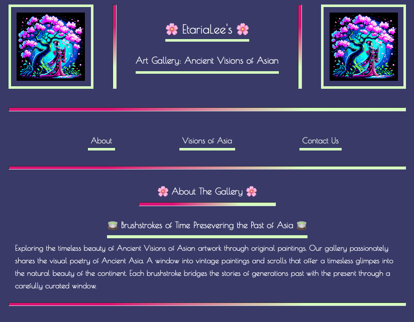
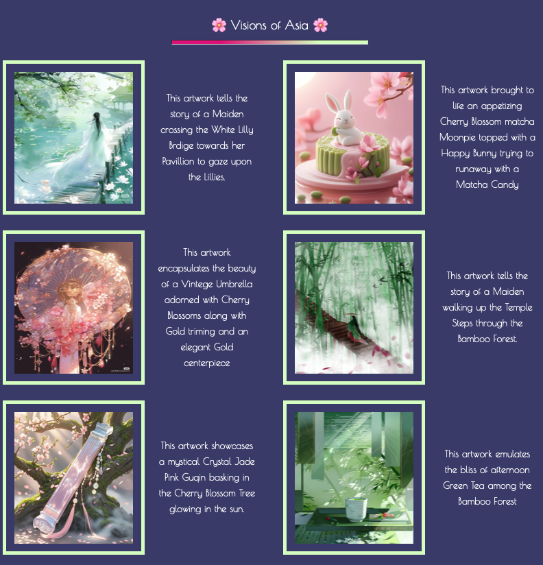
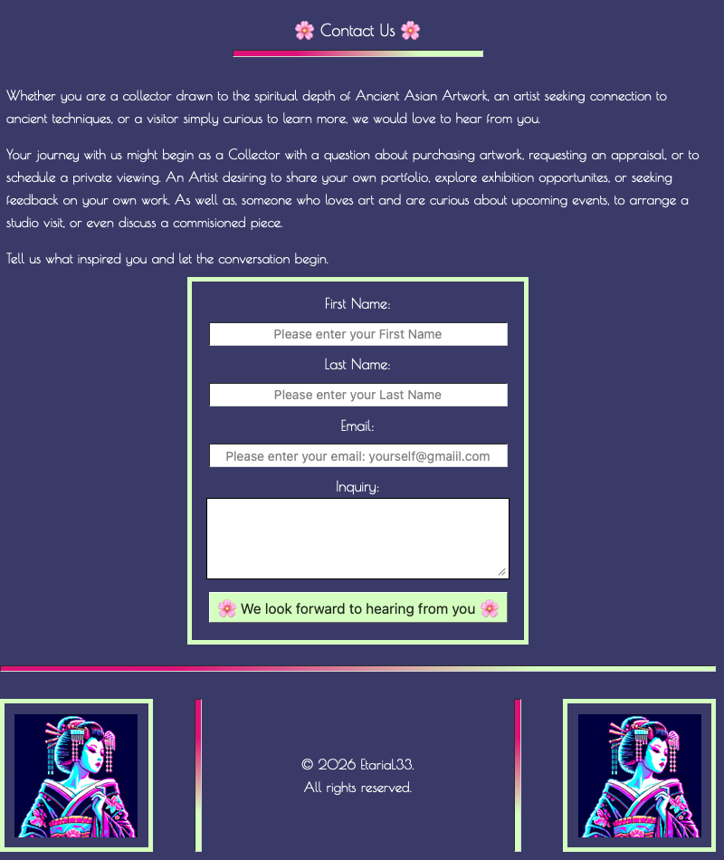

<!-- & This creates a banner for the ReadMe -->

# 
🌸 Art Gallery: Ancient Visions of Asia 🌸

## Practice: Creating a Webpage building upon HTML basics and understanding how to use CSS Basics

### Understanding CSS -> Bringing to life an Art Gallery for a museum website.

## 
💫 Overview

-   [ ] This is a visually immersive mock art gallery website where Ancient Asian inspirted artwork through the ages comes to life.

## 
🎨 Key Design Features

-   [ ] <b>Cherry Blossom theme</b> wraps the whole page in soft purples, mint greens, cherry blossom scheme like walking through a spring garden
-   [ ] <b>Custom Grdient Dividers</b> separates each section with flowing pinks and greens like silk ribbons between stories
-   [ ] <b>Flexbox Layout</b> keeps the header and footer perfectily balancedm with vintage pixel geishas flanking every page
-   [ ] <b>Responsive Gallery Grid</b> lets the artwork breathe, each piece paired with its own story, side by side like scrols unfurling
-   [ ] <b>Interactive Navigation</b> gently guides the visitor from the gallery's story to the artwork to a friendly conversation
-   [ ] <b>Contact Form</b> invites collectors, artists, and dreamers to reach out. Whether to ask about a piece, share their own work, or simply say what moved them

-   [ ] Simple practice to gain a better understanding of the power of adding CSS Styling to a webpage and how it can make it uniquely beautiful
    -   [ ] CSS or Cascading Style Sheet, is a language that paints a website with colors, fonts, layouts, and animations.
    -   [ ] CSS is used to create stunning webpages.
    -   [ ] It can enhance the user experience, and can make a webpage unquie and stand out amongst the rest.
    -   [ ] It is absolutely beautiful to see a webpage come to life and become even more beautiful.

-   [ ] The visual examples of the webpage:
    -   [ ] 
    -   [ ] 
    -   [ ] 

## 
👩🏾‍💻 Semantic Outline of the webpage

-   [ ] The &lt;header&gt; element:
    -   [ ] Is used for the beginning of the webpage
    -   [ ] Houses the title of the webpage along with Logos
    -   [ ] The &lt;figure&gt; element:
        -   [ ] Usually holds an image, illustration, diagram, code snippets, etc...
        -   [ ] It can also hold more than one
    -   [ ] The &lt;img&gt; element:
        -   [ ] Is used for all the images on the webpage

-   [ ] The &lt;nav&gt; element:
    -   [ ] This element tends to contain ordered lists, unordered lists, or even both types of lists
    -   [ ] Each &lt;li&gt; element will house an &lt;a&gt; elements with the #id-name of the desired section or part of the webpage it will be linked within the "href" attribute
        -   [ ] For instance:
            -   [ ] &lt;a href="#desired-section"&gt;🌸 Desired Section🌸&lt;/a&gt;
            -   [ ] <a href="#desired-section">🌸 Desired Section 🌸</a>
                -   [ ] When the user would click the 🌸 Desired Section 🌸 link they would then be navigated to that section of the webpage

-   [ ] The &lt;br&gt; element:
    -   [ ] Creates a new line in your code and forces whatever comes after to start on a new lin

-   [ ] The &lt;hr&gt; element:
    -   [ ] Adds a horizontal line or dividing line across the webpage
    -   [ ] Used to separate sections or different topics on a webpage

-   [ ] The &lt;main&gt; element:
    -   [ ] Is where the main information of the webpage will go
    -   [ ] The &lt;section&gt; element:
        -   [ ] This groups together pieces of similar information
    -   [ ] The &lt;figure&gt; element:
        -   [ ] This will house all each image for the art gallery
        -   [ ] The &lt;fig-caption&gt; element:
            -   [ ] This will give a descriptive captions of each image
    -   [ ] The &lt;form&gt; element:
        -   [ ] This will create an interactive area for the user to input information and then submit that data

-   [ ]  The &lt;footer&gt; element:
    -   [ ]  This element tends to finish off the webpage as it is located at the very bottom of the webpage and is the last set of items that will be seen
    -   [ ] For instance:
        -   [ ] A footnote on the webpage
        -   [ ] Links to different sections of the webpage
        -   [ ] A copyright symbol for copyright information
            -   [ ] & copy; -> is the symbol for copyright
        -   [ ] A link to external sources using the "href" attribute of the &lt;a&gt; element for the links in the list item to external sources
            -   [ ] &lt;a href="/privacy"&gt;Privacy&lt;/a&gt;
                -   [ ] Use the target attribute to open the link path in a new tab instead of the current page
                -   [ ] <a href="/privacy" target="_blank">Privacy</a>
                -   [ ] When the user clicks one of these external links, they would be redirected to a new page with the informat ion

## 
✨ Encompaassed Technologies

-   [ ] HTML:
    -   [ ] Will be the structure and skeleton of how the app will appear on the webpageWill be the structure and skeleton of how the app will appear on the webpage
-   [ ] CSS:
    -   [ ] Encompass the style of the app and give it some flair

